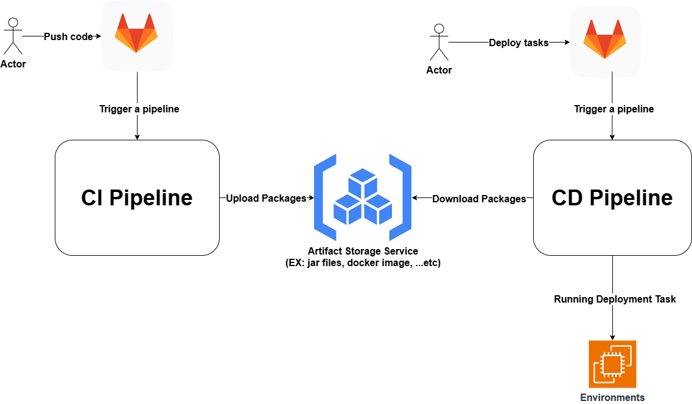

# GitLab_CI_CD_pipeline

## Guides

* 說明底下的skills-demo內的spring-boot demo專案如何做CI/CD分離
    * 
        * 如圖片描述，這邊先以一個CI/CD分離的情境來實作Gitlab的".gitlab-ci.yml"
    * 我們使用2個Gitlab repo:
        * skills-demo/demo-spring-boot-main
            * 模擬開發人員使用這一組repo進行Java spring boot backend API開發，最終會由CI pipeline打包出jar file並上傳至Gtilab artifacts(這邊是先保留7天，詳情.gitlab-ci.yml 配置)
        * skills-demo/demo-spring-boot-deploy-main
            * 模擬維運人員使用這一組repo進行Java spring boot的服務佈署，這邊需要注意的是，維運人員需要跟開發人員溝通，取得"JOB_ID"(這個變數決定我們佈署哪一個Java spring boot的發行版本)，觸發CD pipeline，下載Gtilab artifacts上打包好的jar檔案，並佈署至伺服器環境上
        * 細節的操作請參考各別repo底下的README.md