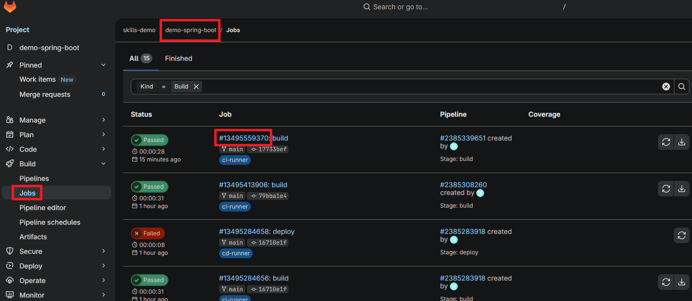
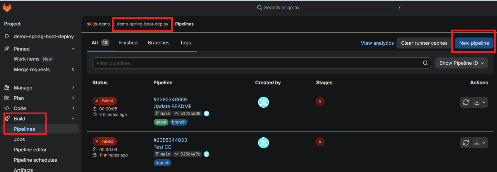
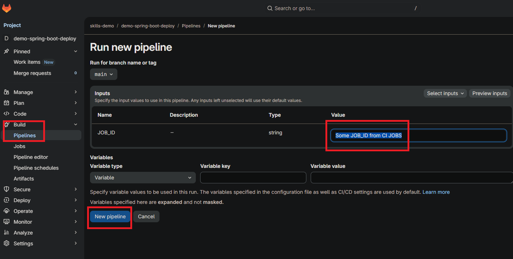
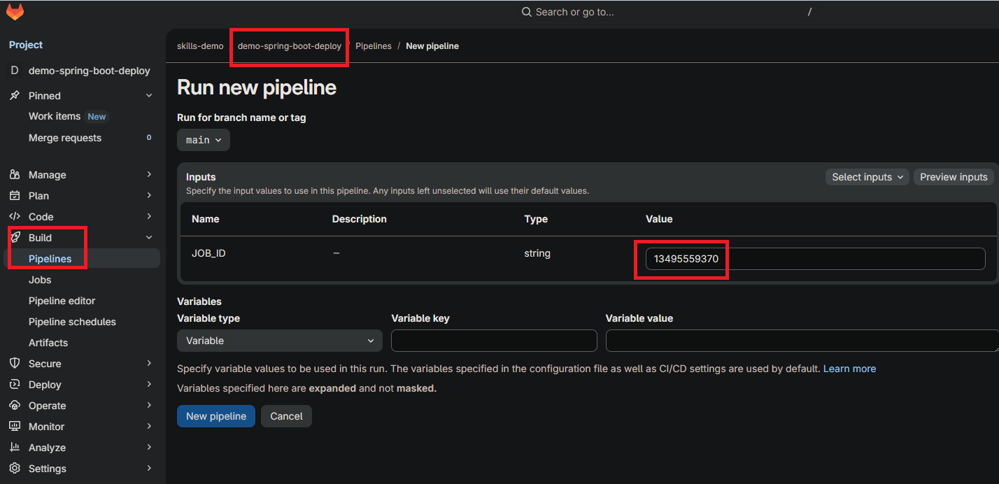
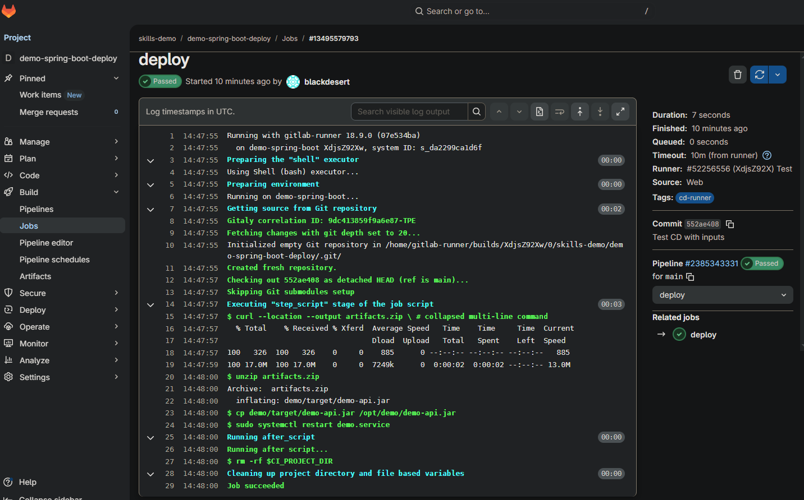

# demo-spring-boot-deploy

## Getting started

* Get JOB_ID from in your demo-spring-boot repo

* Click new pipeline to deploy spring-boot app with this "JOB_ID"

* then replace "JOB_ID from CI JOBS" with this value "13495559370",
  (For Example, we want to download the CI JOB artifact to deploy the latest version of spring-boot jar file to our Linux server)

* Wait deploy

## Docs/Tips

* [docs.gitlab.com/api/job_artifacts](https://docs.gitlab.com/api/job_artifacts/)